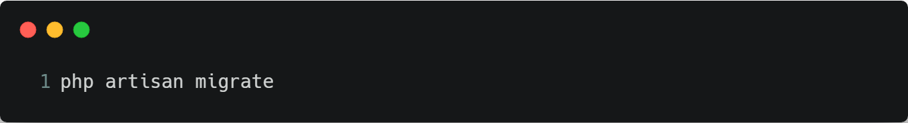

# Kasir Praktikum

## A. Requirements
- PHP versi 7.1.3 keatas
- [Composer](https://getcomposer.org/)
- Koneksi internet

## B. Install
1. Install [Composer](https://getcomposer.org/download/)
1. Buka CMD atau Terminal
1. Install Laravel

    
## C. Konfigurasi
1. Buat database dengan nama dbKasir
1. Buka project kasir dengan text editor
1. Buka file .env 
1. Jika file .env tidak ada, run command berikut dan kemudian generate app key

    
1. Generate app key

        
1. Konfigurasi laravel biasanya adalah konfigurasi database, tapi pastikan juga port MySQL pada .env dan laptop sudah sama

    
1. Jalankan server laravel

    

## D. Membuat Model/Class dan Migration
Dalam project ini ada 5 Model/Tabel yang perlu dibuat, yaitu: ItemCategory, Item, Cart, Transaction dan TransactionDetail. Selain itu kita juga memerlukan 2 file migration lagi untuk membuat Trigger dan Function/Procedure.

1. Membuat model ItemCategory beserta migrationnya.

    
    
    Buka file migration yang telah dibuat dan inisialisasikan atribut tablenya.

    

1. Membuat model Item beserta migrationnya.

    

    

1. Membuat model Cart beserta migrationnya.

    

    

1. Membuat model Transaction beserta migrationnya.

    

    

1. Membuat model TransactionDetail beserta migrationnya.

    
    
    

1. Membuat sebuah file migration untuk trigger bernama item_stock_trigger

    

    
    
1. Memindahkan database migration ke database MySql

    
    
    Apabila terjadi error `SQLSTATE[42000]: Syntax error...` saat migrate, buka file `app/Providers/AppServiceProvider.php` dan ubah menjadi seperti berikut
    
    
    
    Lalu ulangi lagi perintah berikut

    

## E. Menambah Fungsi Relasi
Fungsi - fungsi ini terdapat pada direktori app\ yang berfungsi sebagai menyimpan seluruh file yang berkaitan dengan proses request dan response HTTP.

1. Cart.php
    
    
    
1. Item.php
    
    

1. ItemCategory.php
    
    
    
1. Transaction.php
    
    
    
1. TransactionDetail.php
    
    

1. User.php
    
    

## F. Membuat Halaman Login
Di Laravel, untuk membuat halaman login lengkap dengan registernya, hanya perlu menjalankan perintah berikut

Lalu refresh projek laravel pada browser

