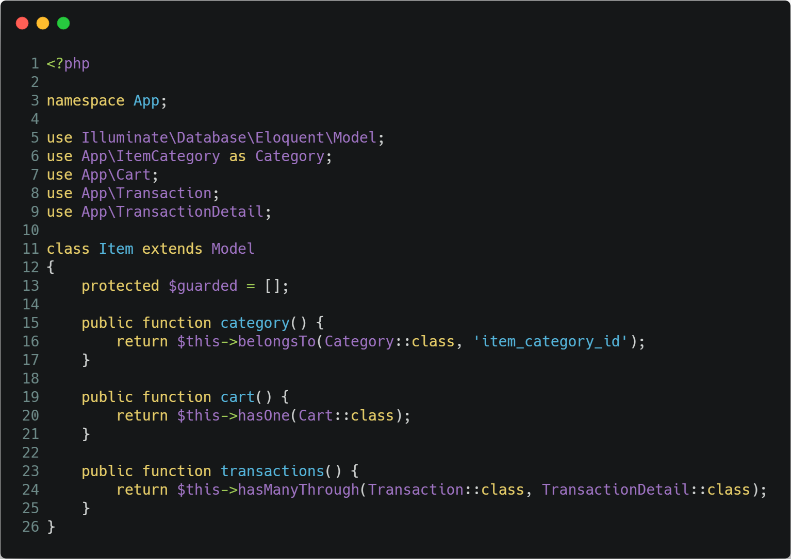

# Kasir Praktikum

## A. Requirements
- PHP versi 7.1.3 keatas
- [Composer](https://getcomposer.org/)
- Koneksi internet

## B. Install
1. Install [Composer](https://getcomposer.org/download/)
1. Buka CMD atau Terminal
1. Install Laravel

    
    
1. Selanjutnya masuk ke folder project kasir dan lanjut ke langkah berikutnya

## C. Konfigurasi
1. Buat database dengan nama `dbKasir`
1. Buka project kasir dengan text editor
1. Buka file `.env`
1. Jika file `.env` tidak ada, run command berikut dan kemudian generate app key

    
1. Generate app key

        
1. Konfigurasi laravel biasanya adalah konfigurasi database, tapi pastikan juga port MySQL pada `.env` dan laptop sudah sama

    
1. Jalankan server laravel

    

## D. Membuat Model/Class dan Migration
Dalam project ini ada 5 Model/Tabel yang perlu dibuat, yaitu: `ItemCategory`, `Item`, `Cart`, `Transaction` dan `TransactionDetail`. Selain itu kita juga memerlukan 2 file migration lagi untuk membuat Trigger dan Function/Procedure.

1. Membuat model `ItemCategory` beserta migrationnya.

    
    
    Buka file migration yang telah dibuat dan inisialisasikan atribut tablenya.

    

1. Membuat model `Item` beserta migrationnya.

    

    

1. Membuat model `Cart` beserta migrationnya.

    

    

1. Membuat model `Transaction` beserta migrationnya.

    

    

1. Membuat model `TransactionDetail` beserta migrationnya.

    
    
    

1. Membuat sebuah file migration untuk trigger bernama `item_stock_trigger`

    

    
    
1. Melakukan migration ke database MySql

    
    
    Apabila terjadi error `SQLSTATE[42000]: Syntax error...` saat migrate, buka file `app/Providers/AppServiceProvider.php` dan ubah menjadi seperti berikut
    
    
    
    Lalu ulangi lagi perintah berikut

    

## E. Menambah Fungsi Relasi
Fungsi - fungsi ini terdapat pada direktori `app/` yang berfungsi untuk menyimpan seluruh file yang berkaitan dengan proses request dan response HTTP.

1. `Cart.php`
    
    
    
1. `Item.php`
    
    

1. `ItemCategory.php`
    
    
    
1. `Transaction.php`
    
    
    
1. `TransactionDetail.php`
    
    

1. `User.php`
    
    

## F. Membuat Halaman Login
Di Laravel, untuk membuat halaman login lengkap dengan registernya, hanya perlu menjalankan perintah berikut

Lalu refresh projek laravel pada browser

## G. Mengubah Route
1. Mengubah route `/` mengarah ke home pada file `routes/web.php`

    

1. Mengubah route `/home` menjadi `/`
    
    1. `app/Http/Controllers/Auth/LoginController.php`
    
        

    1. `app/Http/Controllers/Auth/RegisterController.php`
    
        

    1. `app/Http/Controllers/Auth/ResetPasswordController.php`
    
        

    1. `app/Http/Controllers/Auth/VerificationController.php`
    
        
        
    1. `app/Http/Middleware/RedirectIfAuthenticated.php`
    
        

## H. Seeder ItemCategory

1. Membuat `ItemCategorySeeder`
    
    

1. Menambah data seeder ItemCategory pada `database/seeds/ItemCategorySeeder.php`

    

1. Memanggil `ItemCategorySeeder` pada `DatabaseSeeder`

    
    
1. Mengirim data `Item` ke `/` pada `app/Http/Controllers/HomeController.php`

    ![](carbon/33.png                                                                                                                                                                                                                                                                                                                                                                                                                                                                                                                                                                                                                                                                                                                                                                                                                                                                                                                                                                                                                                                                                                                                                                                                                                                                                                                                                                                                                                                                                                                                                                                                               )

1. (Update) mendefinisikan foreignKey `ItemCategory` pada `app/Item.php`

    

1. 

## I. Mengganti Layout yang Sudah Ada

1. Ubah layout `resources/views/home.blade.php` menjadi seperti berikut

    

    Atau copy code [berikut](https://raw.githubusercontent.com/Khoiron14/kasir/55559ebc26156193fb2c1405f1c9943ffea7c0df/resources/views/home.blade.php)

1. Menampilkan data item di home

    

    Untuk menampilkan modal seperti diatas saat button pilih barang di klik, tambahkan kode berikut pada bagian tag `<tbody>`
    
    
    
    Sehingga menjadi seperti berikut
    
    
